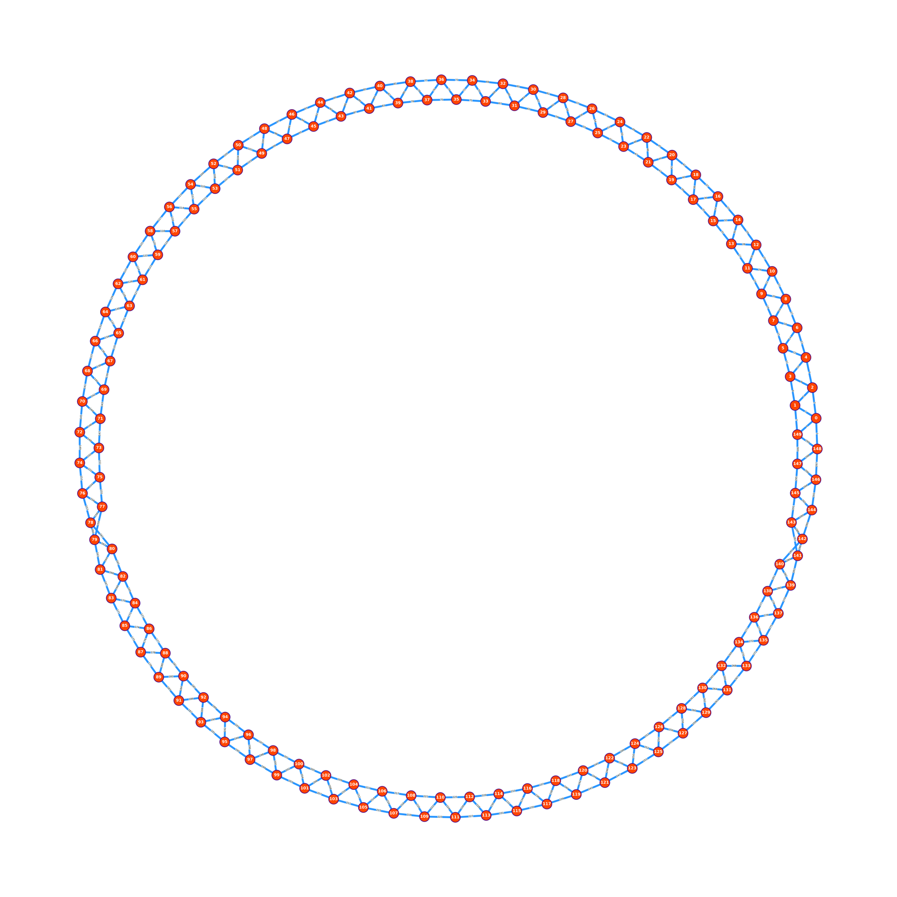
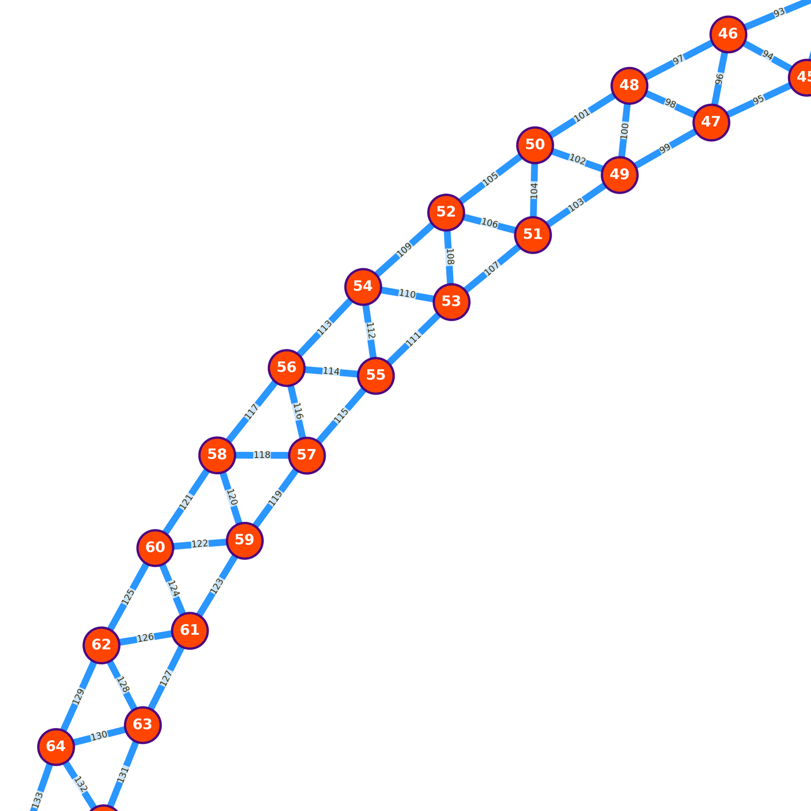

# Junction-Strand Network (A2+B4)

Standalone Python tools to convert a crosslinked atomistic network into a
coarse junction-strand graph, export strand-level connectivity as CSV, and
plot the network for topology verification.

## What This Repo Contains

- `junction_strand_network.py`
  Builds the coarse graph from a LAMMPS data file plus reactive atom index
  files, and writes:
  - `junction_edges.csv`
  - `junction_strand_network_report.txt`
- `plot_junction_strand_network.py`
  Reads `junction_edges.csv` and writes a network plot PNG.
- `export_and_plot_junction_strand_network.py`
  Optional helper script for one-command export/plot workflows.

## Graph Definition

- Node (`junction`): one GLU junction (tetrafunctional crosslinker unit)
- Edge (`strand`): one PVA strand connecting two junctions
- Node labels in plot: GLU junction IDs
- Edge labels in plot: sequential `edge_id` values from the CSV

This is a topology representation, not a molecular-geometry snapshot.

## Inputs

- Crosslinked LAMMPS data file (example: `data.crosslinked`)
- `PVA.txt`: reactive PVA endpoint atom indices (2 per strand)
- `GLU.txt`: reactive GLU atom indices (4 per junction)
- Two distinct reactive atom types in the LAMMPS data

Current mapping in this repo is PVA-GLU specific (`A2+B4`).

## Installation

```bash
pip install -r requirements.txt
```

Dependencies:

- `networkx`
- `numpy`
- `matplotlib`

## Quickstart

Run from repo root (`/users/ass2009/sharedscratch/junction_strand_network`).

### 1. Build CSV + report

```bash
python junction_strand_network.py \
  --data data.crosslinked \
  --pva PVA.txt \
  --glu GLU.txt \
  --atom1-type 9 \
  --atom2-type 10 \
  --csv-out junction_edges.csv \
  --report-out junction_strand_network_report.txt
```

### 2. Plot network

```bash
python plot_junction_strand_network.py \
  --csv junction_edges.csv \
  --out junction_strand_network.png \
  --layout kk \
  --large \
  --labels \
  --edge-labels
```

## Network Diagrams

Full junction-strand network:



Zoomed local junction-strand motif:



## CSV Schema and Column Meanings

Current `junction_edges.csv` columns are:

- `edge_id`
- `source`
- `target`
- `pva_atom_u`
- `pva_atom_v`
- `glu_atom_u`
- `glu_atom_v`
- `is_self_loop`

Detailed meanings:

| Column | Meaning |
| --- | --- |
| `edge_id` | A simple sequential edge number in the exported CSV: `1, 2, 3, ...`. This is an edge/row label. |
| `source` | The GLU junction ID at one end of the PVA strand. |
| `target` | The GLU junction ID at the other end of the PVA strand. |
| `pva_atom_u` | The PVA endpoint atom index that forms the covalent PVA-GLU C-C crosslink bond at the `source` junction side. |
| `pva_atom_v` | The PVA endpoint atom index that forms the covalent PVA-GLU C-C crosslink bond at the `target` junction side. |
| `glu_atom_u` | The reactive GLU carbon atom index covalently bonded to `pva_atom_u` (the source-side PVA-GLU C-C bond pair). |
| `glu_atom_v` | The reactive GLU carbon atom index covalently bonded to `pva_atom_v` (the target-side PVA-GLU C-C bond pair). |
| `is_self_loop` | `0` if the PVA strand connects two different GLU junctions; `1` if both ends connect to the same GLU junction. For the validated networks in this repo, this should be `0` for all edges. |

Short example from the diagram:

- Consider junction nodes `62` and `64` connected by edge label `129` in the zoomed network image.
- The corresponding CSV row is:
  `129,62,64,32001,32248,76935,76985,0`
- Interpretation:
  `edge_id = 129` is the plotted strand label, `source = 62` and `target = 64` are the two GLU junction nodes, (`pva_atom_u`, `glu_atom_u`) = (`32001`, `76935`) is one covalent PVA-GLU C-C bond pair, (`pva_atom_v`, `glu_atom_v`) = (`32248`, `76985`) is the other end bond pair, and `is_self_loop = 0` confirms this strand links two distinct junctions.

## Topology Checks Reported

`junction_strand_network_report.txt` includes:

- Number of junction nodes and strand edges
- Connected components and connectivity status
- Junction functionality / projected degree distribution
- 4-regular and 4-graph-connectivity checks
- Self-loop and parallel-edge diagnostics

### Current Report Interpretation (Example in This Repo)

For the current example data shipped in this repo, the report values are:

- `GLU junction nodes: 150`
- `PVA strand edges: 300`
- `Parallel strand edges: 0`
- `Self-loop strands: 0`
- `Functionality distribution: 4:150`
- `Connected components: 1`
- `Connected: YES`
- `Projected graph 4-regular: YES`
- `4-graph connectivity: YES`

Interpretation:

- The network is fully connected as one macroscopic component.
- Every GLU junction has the expected functionality of 4 (ideal `B4` behavior).
- No topological defects are detected in this sample (`0` self-loops, `0` parallel strands).
- This is consistent with a clean loop-free `A2+B4` junction-strand topology.

## Typical Validation Targets (Ideal Loop-Free A2+B4)

- Junction degree = 4 for all GLU junctions
- No self-loops (`is_self_loop = 0` for all edges)
- Single connected component
- No unintended parallel strands unless explicitly allowed

## Files

- `junction_strand_network.py`
- `plot_junction_strand_network.py`
- `export_and_plot_junction_strand_network.py`
- `requirements.txt`
- `data.crosslinked` (example input)
- `PVA.txt` (example reactive strand endpoints)
- `GLU.txt` (example reactive junction atoms)
